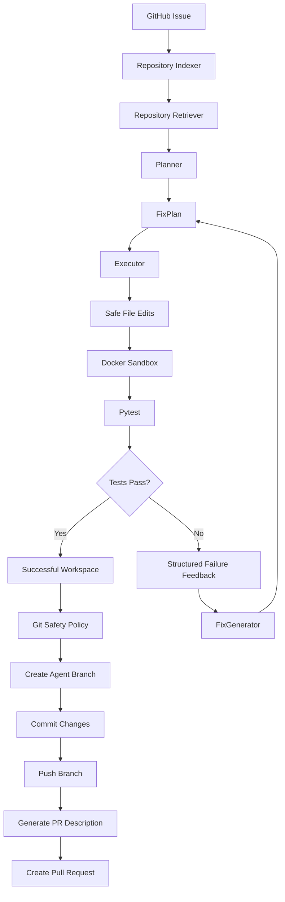

# Autonomous Coding Agent

> An autonomous coding agent that takes a coding issue, understands repository context, creates a structured fix plan, applies safe file edits, runs tests inside an isolated Docker sandbox, reflects on failures, and prepares verified changes for Git and pull-request workflows.

**Status:** v1.0.0
**Python:** 3.12+
**Sandbox:** Docker
**Test Suite:** 49 passing

---

## Overview

The Autonomous Coding Agent is an end-to-end software engineering system designed to automate the workflow from a coding issue to a verified repository change.

The core idea is simple:

> Writing code is only one part of software engineering. An autonomous coding agent must also understand the repository, execute the change safely, run tests, learn from failures, and package the verified result for review.

The system follows a complete engineering workflow:

```text
GitHub Issue
     ↓
Repository Context
     ↓
FixPlan
     ↓
Safe File Edits
     ↓
Sandbox Execution
     ↓
Pytest
     ↓
Structured Failure Feedback
     ↓
Self-Correction
     ↓
Successful Workspace
     ↓
Git Branch
     ↓
Commit
     ↓
Push
     ↓
Pull Request
```

The project focuses on the engineering infrastructure required to make autonomous coding systems more reliable, testable, and safer.

---

# Architecture



---

# End-to-End Workflow

The complete agent workflow is:

```text
┌──────────────────┐
│   GitHub Issue   │
└────────┬─────────┘
         ↓
┌──────────────────┐
│ Repository       │
│ Indexing         │
└────────┬─────────┘
         ↓
┌──────────────────┐
│ Context          │
│ Retrieval        │
└────────┬─────────┘
         ↓
┌──────────────────┐
│ FixPlan          │
│ Generation       │
└────────┬─────────┘
         ↓
┌──────────────────┐
│ Safe File        │
│ Editing          │
└────────┬─────────┘
         ↓
┌──────────────────┐
│ Docker Sandbox   │
└────────┬─────────┘
         ↓
┌──────────────────┐
│ Pytest           │
└────────┬─────────┘
         ↓
      ┌──┴───┐
      │      │
    PASS    FAIL
      │      │
      ↓      ↓
    Git    Failure
           Feedback
              ↓
        FixGenerator
              │
              └──────→ FixPlan
```

---

# Core Components

## 1. Repository Context

Before making a change, the agent needs to understand the repository.

The repository layer provides:

* Repository indexing
* File discovery
* Relevant file retrieval
* Code snippet retrieval
* Test discovery
* Repository-aware context for planning

The goal is to provide the planner with relevant repository information rather than treating the repository as an unknown collection of files.

---

# 2. Fix Planning

The planner converts an issue and retrieved repository context into a structured `FixPlan`.

A `FixPlan` contains:

* Issue summary
* Problem description
* Target files
* Planned changes
* Tests to run
* Rationale
* Concrete file edits

The planner is responsible for answering:

```text
WHAT should change?
```

It does not directly execute shell commands or modify the repository.

---

# 3. Safe File Editing

Repository changes are represented using explicit file edits.

Each `FileEdit` contains:

```text
file_path
old_text
new_text
```

Before applying an edit, the executor validates the target.

The system checks:

* Repository path exists
* Target path is valid
* Target file exists
* File can be read as UTF-8
* Expected text exists
* Expected text occurs exactly once

This makes the editing process deterministic and prevents ambiguous text replacement.

---

# 4. Docker Sandbox

Generated code and tests execute inside an isolated Docker sandbox instead of directly on the host.

The sandbox is designed to establish a security boundary around untrusted or generated code.

## Sandbox Security Controls

```text
Network
    ↓
Disabled by default

Memory
    ↓
512 MB

CPU
    ↓
1.0 CPU

Process Limit
    ↓
100 PIDs

Capabilities
    ↓
All dropped

Privilege Escalation
    ↓
Disabled

Command Timeout
    ↓
30 seconds by default
```

Docker execution uses:

```text
--network none
--memory 512m
--cpus 1.0
--pids-limit 100
--cap-drop ALL
--security-opt no-new-privileges:true
```

These controls reduce the impact of problematic generated code, infinite processes, excessive resource consumption, and unauthorized network activity.

Network access can be explicitly enabled through configuration when required.

---

# 5. Test Execution

The sandbox executes real `pytest` commands against the modified workspace.

Each command produces structured execution information including:

* Command
* Return code
* Standard output
* Standard error
* Timeout state
* Success state

The agent therefore does not assume that a generated change works.

It verifies the change through actual test execution.

---

# 6. Reflection and Self-Correction

One of the core parts of the system is the bounded reflection loop.

The loop follows:

```text
FixPlan
   ↓
Execute
   ↓
Run Tests
   ↓
Failure
   ↓
FailureFeedback
   ↓
FixGenerator
   ↓
New FixPlan
   ↓
Execute Again
```

When a test fails, the failure output becomes structured feedback for the next correction attempt.

The reflection loop tracks:

* Iteration number
* Execution result
* Test output
* Failure information
* Maximum iteration count

The loop terminates when:

1. Tests pass
2. Maximum iterations are reached
3. A corrective FixPlan cannot be generated

This creates bounded autonomy rather than an unrestricted retry loop.

---

# 7. Git Automation

Once the workspace has been successfully verified, the Git layer manages repository state.

The Git workflow is:

```text
Successful Workspace
        ↓
Create Agent Branch
        ↓
Stage Changes
        ↓
Commit
        ↓
Push
```

Git commands are executed using structured subprocess arguments rather than shell command strings.

This avoids unnecessary shell interpretation and provides stronger control over Git arguments.

Branch names are also validated before they are passed to Git.

---

# 8. Git Safety Policy

Autonomous Git operations should not have unrestricted repository access.

The `GitSafetyPolicy` provides an additional security boundary around Git operations.

It supports:

* Allowed agent branch
* Protected branches
* Allowed remote
* Force-push policy

Default safety behavior:

```text
main
    → blocked

master
    → blocked

Unauthorized branch
    → blocked

Unauthorized remote
    → blocked

Force push
    → disabled
```

An agent is expected to operate inside its own working branch rather than directly modifying protected branches.

Before committing changes, the Git client checks the actual currently checked-out branch.

This is important because the system does not simply trust the branch it expected to be using.

---

# 9. Pull Request Generation

After the verified branch has been pushed, the system can generate a pull request description.

The generated PR contains structured information about:

### Summary

What changed and why.

### Diff Summary

Information including:

* Files changed
* Insertions
* Deletions

### Test Results

Evidence from the actual test execution and reflection process.

### Verification

Whether the implementation successfully passed verification.

The goal is to make the resulting PR useful for human review rather than simply creating a repository change with no context.

---

# Evaluation Benchmark

The project includes an end-to-end evaluation benchmark containing three small open-source-style coding issues.

The benchmark is designed to test the complete workflow in fresh workspaces.

## Issue 1 — Empty Average

The average function should safely handle empty input.

Expected behavior:

```python
average([]) == 0.0
```

A regression test is added to verify the behavior.

---

## Issue 2 — Username Whitespace

The greeting function should normalize surrounding whitespace from the username.

Example:

```text
" Alice "
```

should be treated as:

```text
"Alice"
```

A regression test verifies the behavior.

---

## Issue 3 — Negative Values

Invalid negative values should be rejected with a meaningful `ValueError`.

A regression test verifies the validation behavior.

---

# Evaluation Metrics

Each benchmark run records:

* Issue ID
* Issue title
* Success/failure
* Reflection iterations
* Execution duration
* Error information
* Test output
* Changed files

The evaluation therefore measures more than whether a final answer was produced.

It captures whether the system actually executed, tested, and verified the resulting workspace.

---

# Validation

The project has been validated using the automated test suite.

Current validation:

```text
GitHub tests
49 passed

Sandbox tests
14 passed

Full project suite
49 passed
```

Final full-suite validation:

```text
49 passed in 30.07s
```

The Git safety tests validate:

```text
Allowed branch                  ✓
Protected main branch          ✓
Protected master branch        ✓
Unauthorized branch            ✓
Allowed remote                 ✓
Unauthorized remote            ✓
Force push blocked             ✓
Force push explicitly allowed  ✓
Invalid branch configuration   ✓
Protected agent branch         ✓
```

The sandbox tests validate:

```text
Network disabled by default    ✓
Network can be enabled         ✓
Memory limit                   ✓
CPU limit                      ✓
PID limit                      ✓
Capabilities dropped           ✓
No privilege escalation       ✓
Command timeout validation     ✓
```

---

# Example Generated Pull Requests

The system can generate PR descriptions containing structured engineering evidence.

## Example 1 — Empty Average

```text
Title:
Fix average handling for empty input

Summary:
Updated the average calculation to safely handle empty
input and added regression coverage.

Diff Summary:
Files changed: 2
Insertions: 8
Deletions: 1

Test Results:
pytest tests/test_stats.py

2 passed

Verification:
All targeted tests passed successfully inside the sandbox.
```

---

## Example 2 — Username Whitespace

```text
Title:
Normalize usernames before greeting

Summary:
Updated greeting generation to normalize surrounding
whitespace and added regression coverage.

Diff Summary:
Files changed: 2
Insertions: 6
Deletions: 1

Test Results:
pytest tests/test_greetings.py

2 passed

Verification:
All targeted tests passed successfully inside the sandbox.
```

---

## Example 3 — Negative Values

```text
Title:
Validate negative values in statistics calculation

Summary:
Added validation for negative input values and added
regression coverage for invalid input.

Diff Summary:
Files changed: 2
Insertions: 7
Deletions: 1

Test Results:
pytest tests/test_stats.py

2 passed

Verification:
All targeted tests passed successfully inside the sandbox.
```

These examples demonstrate the structure of the generated PR output.

---

# Project Structure

```text
Autonomous-Coding-Agent/
│
├── app/
│   │
│   ├── agent/
│   │   ├── executor.py
│   │   ├── fixer.py
│   │   ├── loop.py
│   │   ├── planner.py
│   │   └── reflection.py
│   │
│   ├── evaluation/
│   │   ├── fix_plans.py
│   │   ├── models.py
│   │   └── runner.py
│   │
│   ├── github/
│   │   ├── client.py
│   │   ├── diff.py
│   │   ├── github_client.py
│   │   ├── pr.py
│   │   ├── pr_manager.py
│   │   ├── safety.py
│   │   ├── test_results.py
│   │   └── workflow.py
│   │
│   ├── repo/
│   │   ├── context.py
│   │   ├── indexer.py
│   │   └── retriever.py
│   │
│   └── sandbox/
│       ├── manager.py
│       ├── models.py
│       └── runner.py
│
├── tests/
│   │
│   ├── agent/
│   │
│   ├── evaluation/
│   │
│   ├── github/
│   │
│   ├── repo/
│   │
│   └── sandbox/
│
├── Dockerfile
├── docker-compose.yml
├── pytest.ini
├── requirements.txt
├── .gitignore
└── README.md
```

---

# Installation

## Clone the Repository

```bash
git clone https://github.com/rishisingh1406/Autonomous-Coding-Agent.git
cd Autonomous-Coding-Agent
```

## Create a Virtual Environment

```bash
python -m venv .venv
```

### Windows

```powershell
.venv\Scripts\activate
```

### Linux / macOS

```bash
source .venv/bin/activate
```

## Install Dependencies

```bash
pip install -r requirements.txt
```

Make sure Docker is installed and running.

---

# Running the Test Suite

Run all tests:

```bash
pytest -q
```

Run GitHub-related tests:

```bash
pytest tests/github -v
```

Run sandbox tests:

```bash
pytest tests/sandbox -v
```

Run the evaluation benchmark:

```bash
pytest tests/evaluation -v
```

---

# GitHub Configuration

Pull request creation requires a GitHub token.

Set the following environment variable:

```text
GITHUB_TOKEN
```

### Windows PowerShell

```powershell
$env:GITHUB_TOKEN="your-token"
```

### Linux / macOS

```bash
export GITHUB_TOKEN="your-token"
```

Never commit GitHub tokens, API keys, or other secrets to the repository.

---

# Design Principles

The project is built around explicit engineering boundaries.

## 1. Separation of Responsibilities

Each component has a focused responsibility.

```text
Planner
    ↓
WHAT should change

Executor
    ↓
HOW the change is applied

Sandbox
    ↓
WHERE code executes

ReflectionLoop
    ↓
WHEN to retry

GitClient
    ↓
HOW repository state changes

GitSafetyPolicy
    ↓
WHAT Git operations are allowed

PRManager
    ↓
HOW the change is presented for review
```

This separation makes the system easier to test, reason about, and extend.

---

# 2. Secure Defaults

Security-sensitive behavior defaults to restrictive settings.

```text
Network
    → disabled

Force push
    → disabled

Protected branches
    → blocked

Unauthorized remotes
    → blocked

Resource usage
    → bounded

Execution time
    → bounded
```

The principle is:

> Autonomous systems should fail closed wherever possible.

---

# 3. Bounded Autonomy

Autonomous behavior needs explicit limits.

The reflection loop has a maximum number of iterations.

The sandbox has:

* CPU limits
* Memory limits
* PID limits
* Command timeout

Git operations have:

* Branch restrictions
* Remote restrictions
* Force-push restrictions

The objective is to make autonomy controllable rather than unlimited.

---

# 4. Verify Instead of Assume

The agent does not consider generated code successful merely because a code change was produced.

The implementation must be executed and tested.

The workflow therefore follows:

```text
Generate
   ↓
Execute
   ↓
Test
   ↓
Observe
   ↓
Correct if necessary
   ↓
Verify
```

---

# Current Limitations

This v1 is an engineering foundation for an autonomous coding system rather than a production-scale coding platform.

Current limitations include:

* The evaluation benchmark uses deterministic fix-plan generation.
* Repository retrieval is intentionally lightweight.
* Large repositories will require more sophisticated retrieval and ranking.
* GitHub authentication requires external configuration.
* Sandbox execution currently focuses on Docker isolation.
* The system does not yet perform unrestricted autonomous issue triage.
* The system does not yet provide complete production-scale multi-repository orchestration.
* Human approval and enterprise policy controls are future extensions.

These limitations are intentional and define areas for future development.

---

# Roadmap

Future versions can extend the system with:

* LLM-driven fix generation
* Advanced repository retrieval
* AST-aware code editing
* Multi-file dependency reasoning
* Intelligent test selection
* Patch validation
* Persistent agent memory
* Execution tracing
* Evaluation dashboards
* CI/CD integration
* Multi-repository support
* Human approval gates
* Production deployment
* More advanced sandbox isolation
* Failure classification
* Improved autonomous debugging

---

# v1 Milestone

The v1 system demonstrates a complete coding-agent workflow:

```text
Issue
 ↓
Repository Understanding
 ↓
Planning
 ↓
Safe Editing
 ↓
Sandbox Execution
 ↓
Testing
 ↓
Failure Feedback
 ↓
Self-Correction
 ↓
Git Branch
 ↓
Commit
 ↓
Push
 ↓
Pull Request
```

The key milestone is not simply that the agent can generate code.

The system demonstrates the larger engineering loop:

> **Understand → Change → Execute → Test → Reflect → Correct → Verify → Ship**

while operating inside explicit execution and Git safety boundaries.

---

# Engineering Progress

The project has evolved from individual coding-agent components into a connected engineering workflow.

```text
Repository Context
        ↓
Planning
        ↓
Code Editing
        ↓
Sandbox Execution
        ↓
Real Test Execution
        ↓
Reflection
        ↓
Git Automation
        ↓
Pull Request Generation
        ↓
Evaluation
        ↓
Safety Rails
        ↓
v1
```

The result is a foundation for building more capable autonomous software-engineering agents.

